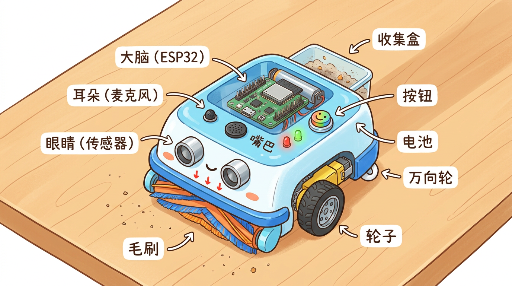
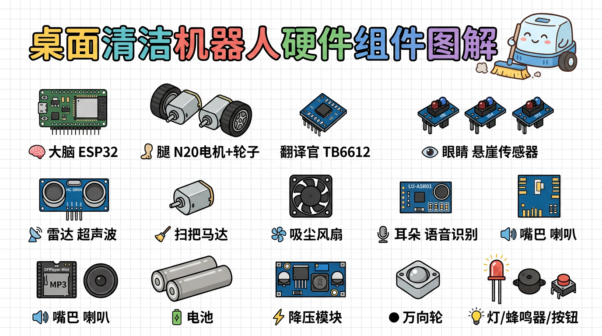
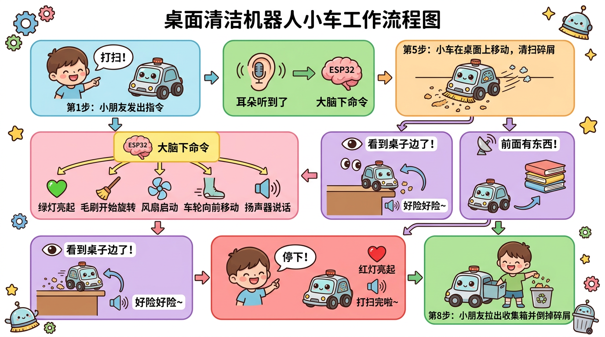

# 我的智能清洁小车 — 硬件大揭秘

> 这份文档是写给 9 岁小朋友看的！每个零件都会用你能听懂的话来解释。

---

## 小车长什么样？



## 零件全家福



---

## 小车的全家福

我们的清洁小车，就像一个**会自己跑、会自己扫地、还会说话的桌面小管家**。它的身体里装了好多小零件，每个零件都有自己的"工作"。我们来认识一下它们吧！

```
                    【我是清洁小车！】

                  前进方向 ↑

      👁 👁 👁   ← 三只"悬崖眼睛"（防止掉桌子）
     ═══════════   ← 旋转毛刷（扫碎屑）
     ┌───────────┐
     │ 🎤 耳朵   │  ← 语音识别（听你说话）
     │           │
  ○──│           │──○  ← 左轮和右轮（走路用的）
     │  🧠 大脑  │  ← ESP32（指挥所有零件）
     │  📦 垃圾盒│  ← 收集盒（装碎屑）
     │  🔋 电池  │  ← 电池（给大家供电）
     │  🔊 喇叭  │  ← 小喇叭（说话用的）
     └─────┬─────┘
           ●         ← 万向轮（小球轮，帮助平衡）
```

---

## 1. 大脑 — ESP32 开发板

**用大白话说：** 一块只有名片四分之一大小的**迷你电脑**。

### 它干什么？

ESP32 就是小车的**大脑**，负责指挥所有零件干活：

- 告诉轮子"往前走"还是"转弯"
- 问悬崖传感器"前面还有桌子吗？"
- 命令喇叭"说一句好险好险"
- 控制毛刷和风扇的开关

### 长什么样？

```
     大约 5 厘米长，比你的大拇指长一点点

     ┌──────────────────────┐
     │ o o o o o o o o o o  │ ← 左边一排"小脚"（引脚）
     │                      │
     │    ┌──────────┐      │
     │    │  ESP32   │      │ ← 银色金属壳（芯片藏在里面）
     │    │  大脑芯片 │      │
     │    └──────────┘      │
     │                      │
     │ o o o o o o o o o o  │ ← 右边一排"小脚"（引脚）
     │       [USB口]        │ ← 插数据线的地方
     └──────────────────────┘
```

### 打个比方

想象你在玩乐高遥控车。ESP32 就像**你的脑袋** —— 眼睛看到墙了，脑袋决定"要转弯"，然后手去转方向盘。ESP32 也是一样：传感器看到桌子边了，ESP32 决定"要后退"，然后让电机倒着转。

---

## 2. 腿 — N20 减速电机 + 轮子（2 个）

**用大白话说：** 两个**拇指大小的小马达**，各带一个橡胶轮子。

### 它干什么？

两个小马达分别转动左轮和右轮，让小车能**走路**：

- 两个轮子一起向前转 → 小车**直走**
- 左轮转得慢、右轮转得快 → 小车**往左转**
- 两个轮子往后转 → 小车**倒退**

### 长什么样？

```
       电机（拇指大小）        轮子（橡胶的）
      ┌──────────────┐       ╭─────╮
      │  齿轮  电机  │──轴──│  ○  │
      │  箱子  本体  │       ╰─────╯
      └──────────────┘
       比一节5号电池还小       直径约3厘米
```

### 打个比方

你骑过自行车吗？自行车的变速器能让你在上坡时换成"省力档"——蹬得慢但力气大。N20 电机里面也有个**迷你变速箱**（齿轮减速箱），让马达转得慢一点，但力气变大，这样才能推得动小车。

### 为什么要 2 个？

因为要**差速转向**！就像你划船的时候：

- 两只桨一起划 → 船直走
- 只划左边 → 船往右转
- 只划右边 → 船往左转

小车的两个轮子也是这个道理。

---

## 3. 翻译官 — TB6612 电机驱动板

**用大白话说：** 一块**指甲盖大小的电路板**，帮 ESP32 控制电机。

### 为什么需要它？

ESP32 大脑虽然聪明，但"力气"很小（电流很小），直接接电机根本带不动。TB6612 就是中间的**翻译官 + 力气放大器**：

```
   ESP32（大脑）            TB6612（翻译官）           电机（腿）
   "往前走，速度70%"  ──→   把电池的大电流    ──→    轮子转起来！
   （小小的信号）           按要求送给电机          （需要大电流）
```

### 打个比方

你在教室里小声跟同学说"开窗户"，你的声音太小，坐在最后一排的同学听不到。但是如果你告诉老师（TB6612），老师大声说"把窗户打开！"，最后一排就能听到了。TB6612 就是那个帮你**把小信号变成大力气**的"老师"。

---

## 4. 悬崖眼睛 — TCRT5000 红外传感器（3 个）

**用大白话说：** 三个**朝下看的小眼睛**，用看不见的光（红外线）检查下面有没有桌面。

### 它干什么？

装在小车肚子底下的最前面，一直往下"看"：

- 看到桌面 → **安全**，继续走
- 看到桌子边（空气，没桌面了）→ **危险！** 赶紧告诉大脑后退！

### 工作原理

```
    【安全！继续走】              【危险！要掉下去了！】

      传感器                        传感器
      ↓↓↓  发出红外线               ↓↓↓  发出红外线
      ↑↑↑  反射回来了！             ........  射出去，没回来！
    ━━━━━━━━ 桌面                         ┃ 桌子边缘
                                          ┃
                                       （空气不反射光）
```

### 打个比方

你晚上拿手电筒往地上照：

- 照到地板 → 光**反射回来**，你能看到地板 → 脚下有路
- 照到悬崖边 → 光**射进黑暗里不回来** → 前面没路了！

TCRT5000 就是用红外线（人眼看不见的光）做同样的事。

### 为什么要 3 个？

3 个传感器排成一排，像三只眼睛分别看左边、中间、右边：

```
              前进方向 ↑

         👁─────👁─────👁
         左     中     右

   如果左边的说"没桌面了"→ 小车往右转
   如果右边的说"没桌面了"→ 小车往左转
   如果中间的说"没桌面了"→ 小车往后退
```

---

## 5. 前方雷达 — HC-SR04 超声波传感器

**用大白话说：** 一个有**两只大眼睛**的模块，用声音测量前面有多远的东西。

### 它干什么？

装在小车的头上，往前"看"，如果前面有水杯、书本挡着路，就告诉大脑"前面 6 厘米有东西，赶紧绕开！"

### 工作原理

跟蝙蝠一模一样！蝙蝠是靠发出**超声波**（人耳听不到的声音），听**回声**来判断前面有多远：

```
     小车                         水杯
    (○ ○)  ──→ 超声波 ──→ ──→    ┃
    (○ ○)  ←── 回声   ←── ←──    ┃

    发出声音到听到回声，中间隔了多久？
    时间短 = 东西离得近
    时间长 = 东西离得远
```

### 打个比方

你对着山谷大喊"喂——"，过一会儿听到回声"喂——"。如果山很近，回声很快就回来；如果山很远，要等好久。超声波传感器就是用**听不到的声音**做同样的事，只不过它算得特别精确，能精确到厘米！

### 长什么样？

```
     ┌───────────────────┐
     │                   │
     │   (○)      (○)    │ ← 左边"嘴巴"发超声波，右边"耳朵"听回声
     │                   │
     └───────────────────┘
          大约 4.5 厘米宽
```

---

## 6. 扫把 — 130 小电机 + 旋转毛刷

**用大白话说：** 一个**玩具车里的小马达**，带着一个**小刷子**高速旋转，把碎屑从桌面上扫起来。

### 它干什么？

装在小车肚子最前面，毛刷贴着桌面：

1. 马达带着刷子**高速旋转**
2. 刷毛把橡皮屑、纸屑**扫起来**
3. 碎屑被扫到后面的**吸风口**

```
      130 电机
         │
         │ 转轴
         ↓
   ┌───────────┐
   │  旋转毛刷  │  ← 刷毛朝下贴着桌面
   └───────────┘
     ↓↓↓↓↓↓↓↓↓
   桌面上的碎屑被扫到后方 → 被风扇吸进收集盒
```

### 打个比方

妈妈扫地用的**扫帚**，你得自己拿着它来回扫。130 电机就是一把**会自己转的迷你电动扫帚**，你不用动手，它自己刷刷刷地转，把碎屑扫过去。

### 和走路的马达有什么不同？

| | 130 小电机（扫把） | N20 电机（腿） |
|--|---|---|
| 转速 | **超快**（每分钟 8000 圈） | 慢（每分钟 150 圈） |
| 力气 | 小 | **大** |
| 用途 | 带毛刷（要转得快才扫得干净） | 带轮子（要慢但有力才推得动车） |

---

## 7. 吸尘器 — 3010 小风扇

**用大白话说：** 一个**3 厘米大的迷你电扇**，像小型吸尘器一样，把碎屑吸进收集盒。

### 它干什么？

毛刷把碎屑扫起来后，风扇产生**吸力**（像吸尘器一样），把碎屑**吸进收集盒**里。

### 碎屑的旅程

```
  桌面上的碎屑
       ↓
  【旋转毛刷】扫起来
       ↓
  【吸风口】← 风扇产生的吸力，把碎屑吸进去
       ↓
  【收集盒】碎屑留在盒子里
       ↓
  【滤网 → 出风口】干净的空气吹出去，碎屑被挡住
```

### 打个比方

你见过妈妈用的**吸尘器**吧？吸尘器里面有个大风扇，旋转产生吸力，把灰尘吸进去，灰尘被滤袋挡住，干净的空气从后面排出。我们的 3010 小风扇做的是**完全一样的事**，只是小了很多很多！

---

## 8. 垃圾盒 — 收集盒 + 滤网

**用大白话说：** 一个**手掌心大小的小盒子**，用来装毛刷扫起来的碎屑。

```
     ┌──────────────┐
     │              │
     │   碎屑碎屑   │  ← 碎屑在里面
     │   碎屑碎屑   │
     │──────────────│  ← 滤网（纱布），挡住碎屑
     │   出风口     │  ← 干净的空气从这里出去
     └──────────────┘

     用完后拉出盒子，倒掉碎屑，就像倒垃圾桶一样！
```

---

## 9. 耳朵 — LU-ASR01 语音识别模块

**用大白话说：** 一个**能听懂你说话的小芯片**，不用联网就能听懂！

### 它干什么？

你对着小车说话，LU-ASR01 听到后告诉 ESP32 大脑：

| 你说 | LU-ASR01 听到 | 大脑的反应 |
|------|-------------|-----------|
| "打扫" | "主人说打扫！" | 开始清扫 |
| "停下" | "主人说停下！" | 停止清扫 |
| "你好" | "主人打招呼了！" | 播放彩蛋语音 |

### 打个比方

你家有**智能音箱**（小爱同学、天猫精灵）吗？你说"小爱同学，播放音乐"，它就播放。LU-ASR01 做的事情一样 —— 只不过它不需要联网，也不需要插电源，一个小小的芯片就搞定了！

### 长什么样？

```
     ┌────────────────┐
     │   LU-ASR01     │
     │                │
     │  [芯片] [麦克风]│ ← 自带小麦克风收音
     │                │
     │  [USB-C口]     │ ← 用来配置关键词
     └────────────────┘
      只有大约 3 厘米长
```

---

## 10. 嘴巴 — DFPlayer Mini + 小喇叭

**用大白话说：** 一个**迷你 MP3 播放器** + 一个**小喇叭**，让小车能说话！

### 它干什么？

SD 卡（存储卡）里提前录好可爱的声音，DFPlayer 读取 SD 卡，通过小喇叭播放出来：

```
  SD 存储卡（装着录好的声音）
       ↓
  DFPlayer Mini（读取 + 播放）
       ↓
  小喇叭（发出声音）
```

小车会说的话（举例）：

- 开机时："你好呀，我是桌面小管家~"
- 开始清扫："出发咯，我来帮你打扫！"
- 到桌边了："好险好险，差点掉下去~"
- 撞到东西："我绕过去~"
- 清扫完："打扫完啦，记得表扬我哦！"

### 打个比方

你用过**蓝牙音箱**播放手机里的歌吗？DFPlayer 就像一个**超级迷你的蓝牙音箱**，只不过它播放的不是手机里的歌，而是**SD 卡里的声音文件**。ESP32 大脑告诉它"播放第 3 首"，它就播。

---

## 11. 小灯 + 蜂鸣器 + 按钮

### 小灯（LED）

就是**彩色小灯泡**，告诉你小车的状态：

- **绿灯亮** = 正在清扫
- **红灯亮** = 已经停了

```
   绿色 LED    红色 LED
     💚          ❤️
   (清扫中)    (停下来了)
```

### 蜂鸣器

一个**会"嘀嘀"叫的小元件**，开机时会响一声，提醒你小车已经准备好了。

### 按钮

一个**小按钮**，按一下开始清扫，再按一下停止。万一你不想用语音控制，按按钮也行！

---

## 12. 电池 — 给大家供电

**用大白话说：** 2 节**可充电电池**，给小车所有零件供电。

### 为什么用 2 节？

一节电池是 3.7 伏特（电压太低，电机没力气），2 节串起来就是 7.4 伏特，够用了！

```
    ┌──────┐  ┌──────┐
    │电池 1│──│电池 2│    串联 = 3.7V + 3.7V = 7.4V
    │ 3.7V │  │ 3.7V │
    └──────┘  └──────┘
        │
        ↓
   ┌──────────┐
   │ 降压模块  │   把 7.4V 降到 5V
   └──────────┘
        │
        ├──→ ESP32 大脑（需要 5V）
        ├──→ 传感器们（需要 5V）
        ├──→ 语音模块（需要 5V）
        └──→ 风扇和刷子（需要 5V）

   电机直接用 7.4V（它喜欢电压高一点，跑得有力气）
```

### 打个比方

家里的**充电宝**知道吧？里面装的就是这种电池（18650 锂电池）。手机需要 5V 充电，充电宝也有个降压电路把电池电压变成 5V。我们的小车也是一样的道理！

---

## 13. 万向轮 — 小球支撑轮

**用大白话说：** 一个**弹珠大小的金属球**装在底座里，能朝任何方向滚。

### 它干什么？

装在小车屁股底下，不需要电、不需要接线，就是一个**支撑轮**。

```
         左驱动轮 ○         ○ 右驱动轮
                   ╲       ╱
                    ╲     ╱
                     ╲   ╱
                      (●)    ← 万向轮

        三个着地点 = 三角形 = 最稳定！
```

### 打个比方

你见过**购物车**吗？购物车的前轮能 360 度旋转，不管你往哪推它都能跟着走。万向轮做的事一样，只不过它更小，用一个**小金属球**代替了轮子。

---

## 14. MOS 管模块 — 力气放大开关（2 个）

**用大白话说：** 两个**电子开关**，帮 ESP32 控制风扇和刷子。

### 为什么需要它？

ESP32 的"力气"（电流）太小了，直接接风扇和刷子会"累坏"甚至烧掉。MOS 管就是个**力气放大器**：

```
  ESP32："刷子开！速度80%！"
    ↓ （小信号，力气小）
  MOS 管模块："收到！"
    ↓ （接通电池的大电流）
  130 电机：转起来了！（用电池的电，不是 ESP32 的电）
```

### 打个比方

你用遥控器按一下按钮（很轻松），电视就打开了（电视很耗电）。你按按钮的力气很小，但电视接了电源线，用的是插座里的大电流。MOS 管就像那个**遥控器的接收器**，ESP32 按一下"遥控器"，MOS 管就把电池的大电流接给电机。

---

## 所有零件的分工总结

```
┌─────────────────────────────────────────────────────┐
│                   智能清洁小车                         │
│                                                      │
│  🧠 大脑（ESP32）── 指挥所有人                        │
│    │                                                 │
│    ├── 👁 眼睛（TCRT5000 × 3）── 看桌子边缘          │
│    ├── 📡 雷达（HC-SR04）── 测前方障碍物              │
│    ├── 🎤 耳朵（LU-ASR01）── 听你说话                │
│    ├── 🔊 嘴巴（DFPlayer + 喇叭）── 说话             │
│    ├── 🦿 腿（N20 电机 × 2 → TB6612 驱动）── 走路    │
│    ├── 🧹 扫把（130 电机 + 毛刷 → MOS 管控制）── 扫  │
│    ├── 🌬️ 吸尘器（3010 风扇 → MOS 管控制）── 吸      │
│    ├── 💡 小灯（LED × 2）── 显示状态                  │
│    ├── 🔔 蜂鸣器 ── 提示音                            │
│    └── 🔘 按钮 ── 手动启停                            │
│                                                      │
│  🔋 电池（18650 × 2）── 给大家供电                    │
│  ⚡ 降压模块（LM2596）── 把电压降到 5V                 │
│  📦 收集盒 + 滤网 ── 装碎屑                           │
│  ● 万向轮 ── 支撑平衡                                │
└─────────────────────────────────────────────────────┘
```

---

## 小车是怎么工作的？（完整流程）



用一个小故事来说明：

```
第 1 步：你说"打扫！"
    ↓
  耳朵（LU-ASR01）听到了，告诉大脑
    ↓
第 2 步：大脑（ESP32）下令
    ↓
  "绿灯亮！刷子转起来！风扇开！轮子往前走！"
  嘴巴说："出发咯！"
    ↓
第 3 步：小车开始在桌上跑
    ↓
  毛刷刷刷刷地转，把碎屑扫到后面
  风扇呼呼呼地吸，把碎屑吸进收集盒
    ↓
第 4 步：眼睛发现桌子边了！
    ↓
  "报告大脑！前面没桌子了！"
  大脑命令："后退！转弯！"
  嘴巴说："好险好险~"
    ↓
第 5 步：雷达发现前面有水杯！
    ↓
  "报告大脑！前方 6 厘米有障碍物！"
  大脑命令："后退！绕开！"
  嘴巴说："我绕过去~"
    ↓
第 6 步：你说"停下！"
    ↓
  耳朵听到了，告诉大脑
  大脑命令："所有人停！红灯亮！"
  嘴巴说："打扫完啦~"
    ↓
第 7 步：你拉出收集盒，倒掉碎屑。搞定！
```

---

## 零件数一数

| 零件 | 数量 | 大约多少钱 |
|------|------|-----------|
| ESP32 大脑 | 1 个 | 20 元 |
| N20 电机 + 轮子（腿） | 2 套 | 16 元 |
| TB6612 驱动板（翻译官） | 1 个 | 10 元 |
| 130 小电机（扫把马达） | 1 个 | 2 元 |
| 3010 小风扇（吸尘器） | 1 个 | 5 元 |
| TCRT5000 悬崖传感器（眼睛） | 3 个 | 9 元 |
| HC-SR04 超声波（雷达） | 1 个 | 4 元 |
| LU-ASR01（耳朵） | 1 个 | 35 元 |
| DFPlayer Mini（嘴巴） | 1 个 | 8 元 |
| 小喇叭 | 1 个 | 3 元 |
| SD 存储卡 | 1 张 | 10 元 |
| LED 小灯 | 2 个 | 1 元 |
| 蜂鸣器 | 1 个 | 2 元 |
| 按钮 | 1 个 | 0.5 元 |
| MOS 管模块（力气放大器） | 2 个 | 4 元 |
| 18650 电池 | 2 节 | 12 元 |
| 电池盒（带开关） | 1 个 | 3 元 |
| 降压模块 | 1 个 | 3 元 |
| 万向轮 | 1 个 | 2 元 |
| 收集盒 + 毛刷 + 滤网 | 各 1 | 11 元 |
| 各种线 + 螺丝 | 若干 | 16 元 |
| **全部加起来** | | **约 180 元** |

---

## 小朋友的 Q&A

**Q: 这些零件会不会很难装？**
A: 大部分零件都是用**杜邦线**插起来的（像插积木一样），不需要焊接。外壳用热熔胶粘就行。最难的部分是大人帮忙焊几根线，其他都可以自己来！

**Q: 会不会触电？**
A: 不会！我们用的是 **7.4 伏特**的小电池，和遥控器里的电池差不多，不会触电。但是要注意不要把电池的正极和负极直接用金属线连起来（短路），电池会发热。

**Q: 小车会掉桌子吗？**
A: 不会！3 个悬崖传感器一直在检查前面有没有桌面，只要检测到桌子边缘，小车会立刻后退转弯。就像你走路的时候眼睛看着路，看到悬崖就不会往前走了。

**Q: 如果小车听不懂我说话怎么办？**
A: 旁边还有一个**按钮**，按一下也能启动清扫。语音识别在安静的环境下效果最好，如果周围太吵，用按钮就行。

**Q: 碎屑满了怎么办？**
A: 把收集盒**拉出来**，倒掉碎屑，再塞回去就行了，就像倒垃圾桶一样简单！
